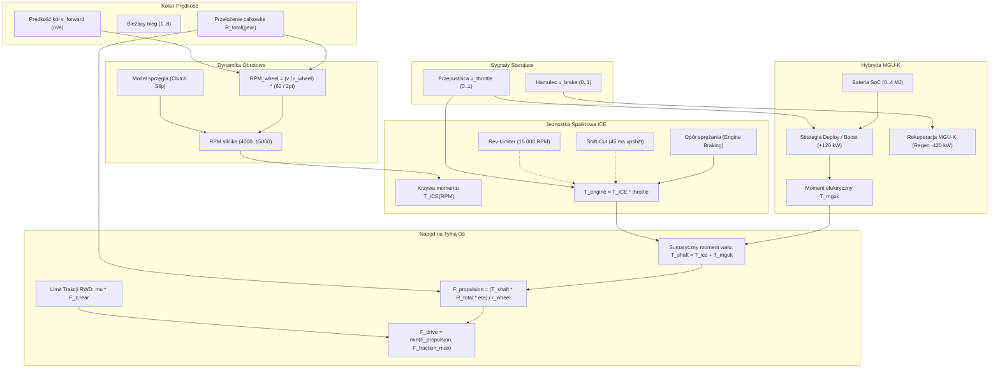

# 🏎️ Architektura Układu Napędowego ICE + 8-Biegowej Skrzyni Biegów i Systemu Hybrydowego ERS/MGU-K dla F1 AI Simulator

Dokument zawiera kompletną specyfikację techniczną, modele matematyczne oraz kod TypeScript eliminujący uproszczenie ciągłej mocy ($P_{max} / v$) na rzecz pełnego, dyskretnego układu napędowego Formuły 1:
1. **8-stopniowa sekwencyjna skrzynia biegów** z przełożeniami F1 i dyferencjałem.
2. **Krzywa charakterystyki silnika spalinowego (ICE)**: 4000–15000 RPM, zmienny moment obrotowy, odcięcie zapłonu (*rev-limiter*), *shift-cut* (45–50 ms) oraz hamowanie silnikiem (*engine braking*).
3. **Układ hybrydowy ERS / MGU-K**: bufor energii baterii (SoC), doładowanie $+120\text{ kW}$ (*Torque Fill*) i rekuperacja energii kinetycznej (*Brake-by-Wire Regen*).
4. **Automatyczna logika zmiany biegów (Auto-Shift)** dla autonomicznych bolidów AI i kierowcy manualnego.
5. **Gotowa do wdrożenia implementacja TypeScript** przygotowana bezpośrednio dla klasy [`Car.ts`](file:///Users/krzysztofbojko/f1simai/src/physics/Car.ts).

---

## 📑 Spis Treści
1. [Geneza i Ograniczenia Modelu Ciągłego ($P/v$)](#1-geneza-i-ograniczenia-modelu-ciągłego-pv)
2. [Schemat Architektury Nowego Układu Napędowego](#2-schemat-architektury-nowego-układu-napędowego)
3. [8-Stopniowa Skrzynia Biegów i Geometria Napędu](#3-8-stopniowa-skrzynia-biegów-i-geometria-napędu)
4. [Charakterystyka Silnika Spalinowego ICE (4000–15000 RPM)](#4-charakterystyka-silnika-spalinowego-ice-400015000-rpm)
   - 4.1 [Krzywa Momentu Obrotowego i Wpływ Regulacji FIA](#41-krzywa-momentu-obrotowego-i-wpływ-regulacji-fia)
   - 4.2 [Sprzęgło Startowe (Clutch Slip Model)](#42-sprzęgło-startowe-clutch-slip-model)
   - 4.3 [Shift-Cut i Odcięcie Zapłonu (Rev-Limiter)](#43-shift-cut-i-odcięcie-zapłonu-rev-limiter)
   - 4.4 [Hamowanie Silnikiem (Engine Braking)](#44-hamowanie-silnikiem-engine-braking)
5. [System Hybrydowy ERS / MGU-K (+120 kW i Rekuperacja)](#5-system-hybrydowy-ers--mgu-k-120-kw-i-rekuperacja)
   - 5.1 [Model Baterii i Stan Naładowania (State of Charge - SoC)](#51-model-baterii-i-stan-naładowania-state-of-charge---soc)
   - 5.2 [Strategia Doładowania (Torque Fill / Deployment)](#52-strategia-doładowania-torque-fill--deployment)
   - 5.3 [Rekuperacja Energii i Brake-by-Wire (Harvesting)](#53-rekuperacja-energii-i-brake-by-wire-harvesting)
6. [Algorytm Automatycznej Zmiany Biegów (Auto-Shift Logic)](#6-algorytm-automatycznej-zmiany-biegów-auto-shift-logic)
7. [Kompletny Kod TypeScript dla `Car.ts`](#7-kompletny-kod-typescript-dla-carts)
8. [Integracja z Pętlą Fizyki i Telemetrią](#8-integracja-z-pętlą-fizyki-i-telemetrią)

---

## 1. Geneza i Ograniczenia Modelu Ciągłego ($P/v$)

Dotychczasowy model w [`Car.ts`](file:///Users/krzysztofbojko/f1simai/src/physics/Car.ts#L571-L577) wyliczał siłę napędową ze wzoru ciągłego:
$$F_{drive} = \frac{P_{eff}}{\max(12.0, v_{forward})}$$

### Wady modelu uproszczonego:
1. **Brak dynamiki obrotów silnika (RPM)**: Bolid zachowywał się jak pojazd z bezstopniową przekładnią CVT lub tramwaj elektryczny; brak charakterystycznego ryku wkręcania się na obroty i spadku RPM po wbiciu wyższego biegu.
2. **Nierealistyczny moment obrotowy przy niskich prędkościach**: Zabezpieczenie $\max(12.0, v)$ generowało stałą siłę $62.5\text{ kN}$ poniżej $43\text{ km/h}$, zamiast odwzorować faktyczny moment silnika pomnożony przez przełożenie pierwszego biegu i poślizg sprzęgła.
3. **Brak przerw w dostarczaniu momentu (Shift-Cut)**: Nowoczesne skrzynie kłowe F1 zmieniają bieg bez sprzęgła w czasie $\approx 45\text{ ms}$, odcinając zapłon, co wywołuje charakterystyczne szarpnięcie wzdłużne bolidu.
4. **Brak rozróżnienia ICE vs ERS**: Hybryda F1 składa się z turbodoładowanego silnika spalinowego (o wyczuwalnej bezwładności i turbo lagu) oraz silnika elektrycznego MGU-K o natychmiastowej reakcji na gaz.

---

## 2. Schemat Architektury Nowego Układu Napędowego



---

## 3. 8-Stopniowa Skrzynia Biegów i Geometria Napędu

### 3.1 Geometria Kół i Promień Dynamiczny
Współczesny bolid F1 wykorzystuje 18-calowe felgi z oponami Pirelli o średnicy zewnętrznej $720\text{ mm}$:
$$r_{wheel} = 0.360\text{ m}$$
Obwód toczny koła wynosi:
$$C_{wheel} = 2 \cdot \pi \cdot r_{wheel} \approx 2.2619\text{ m}$$

### 3.2 Przełożenia Biegów (Gear Ratios) i Przełożenie Główne (Final Drive)
Regulamin FIA narzuca stały zestaw 8 przełożeń na cały sezon wyścigowy. Przełożenie główne dyferencjału wynosi $R_{final} = 4.00$, a sprawność mechaniczną przekładni przyjęto na poziomie $\eta_{trans} = 0.965$ ($96.5\%$).

Całkowite przełożenie napędu na biegu $g$ wynosi:
$$R_{total}(g) = R_{gear}(g) \cdot R_{final}$$

| Bieg | Przełożenie biegu $R_{gear}$ | Przełożenie całkowite $R_{total}$ | Prędkość przy 10 500 RPM | Prędkość przy 13 500 RPM (Upshift) | Prędkość przy 15 000 RPM (Limiter) | Zastosowanie na torze |
| :---: | :---: | :---: | :---: | :---: | :---: | :--- |
| **1** | **3.40** | **13.60** | $64\text{ km/h}$ | $83\text{ km/h}$ | $92\text{ km/h}$ | Ruszanie z pól startowych, nawrót Monaco |
| **2** | **2.65** | **10.60** | $83\text{ km/h}$ | $106\text{ km/h}$ | $118\text{ km/h}$ | Ciasne szykany i nawroty (np. Monza T1/T2) |
| **3** | **2.12** | **8.48** | $103\text{ km/h}$ | $133\text{ km/h}$ | $148\text{ km/h}$ | Wolne zakręty 90° |
| **4** | **1.75** | **7.00** | $125\text{ km/h}$ | $161\text{ km/h}$ | $179\text{ km/h}$ | Średnie zakręty |
| **5** | **1.46** | **5.84** | $150\text{ km/h}$ | $193\text{ km/h}$ | $215\text{ km/h}$ | Wyjścia na proste, łuki średniej prędkości |
| **6** | **1.24** | **4.96** | $177\text{ km/h}$ | $227\text{ km/h}$ | $253\text{ km/h}$ | Szybkie łuki (np. Copse, Pouhon) |
| **7** | **1.07** | **4.28** | $205\text{ km/h}$ | $263\text{ km/h}$ | $293\text{ km/h}$ | Długie proste dojazdowe |
| **8** | **0.86** | **3.44** | $255\text{ km/h}$ | $328\text{ km/h}$ | **$365\text{ km/h}$** *(z DRS $\sim 385$)* | Główne proste Monza, Spa, Baku |

---

## 4. Charakterystyka Silnika Spalinowego ICE (4000–15000 RPM)

Silnik spalinowy to jednostka V6 Turbo o pojemności $1.6\text{ l}$.
- Obroty biegu jałowego: $\text{RPM}_{idle} = 4000$
- Początek efektywnego doładowania turbo: $\text{RPM}_{spool} = 7000$
- Limit regulaminowy przepływu paliwa FIA ($100\text{ kg/h}$): $\text{RPM}_{fuel\_limit} = 10500$
- Optymalna zmiana biegu: $\text{RPM}_{upshift} = 13500$
- Maksymalne dopuszczalne obroty (odcięcie): $\text{RPM}_{max} = 15000$

### 4.1 Krzywa Momentu Obrotowego i Wpływ Regulacji FIA
Moc silnika spalinowego wynosi około $630\text{ kW}$ (~$855\text{ KM}$). Z relacji $P = T \cdot \omega$:
$$T_{ICE} = \frac{P}{\frac{2 \pi \cdot \text{RPM}}{60}}$$

Krzywa momentu $T_{ICE}(\text{RPM})$ na wale korbowym jest modelowana analitycznie w trzech zakresach:

```
Moment [Nm]
  600 │                 ┌─────────────────┐
  500 │               ┌─┘                 └─┐
  400 │            ┌──┘                     └──┐
  300 │        ┌───┘                           └───┐
  200 │  ──────┘                                   └── [REV-LIMITER]
    0 └───┴───────┴───────┴─────────┴─────────┴─────────┴──► RPM
        4000    6000    8000      10500     13500     15000
```

1. **Strefa Turbo-Lag ($4000 \le \text{RPM} < 7500$):**
   Turbosprężarka buduje ciśnienie. Moment rośnie od wartości wolnossącej $280\text{ Nm}$ do $480\text{ Nm}$:
   $$T(\text{RPM}) = 280 + 200 \cdot \left(\frac{\text{RPM} - 4000}{3500}\right)^{1.3}$$

2. **Strefa Maksymalnego Momentu ($7500 \le \text{RPM} \le 10500$):**
   Pełne ciśnienie doładowania ($\approx 3.5\text{ bar}$). Moment osiąga szczytowe **$530\text{ Nm}$**:
   $$T(\text{RPM}) = 480 + 50 \cdot \sin\left(\pi \cdot \frac{\text{RPM} - 7500}{6000}\right)$$

3. **Strefa Regulacji Paliwowej FIA ($10500 < \text{RPM} \le 15000$):**
   Przepływ paliwa jest zablokowany na $100\text{ kg/h}$, co oznacza stałą moc cieplną. Wraz ze wzrostem obrotów moment obrotowy łagodnie spada, zachowując niemal stałą moc $\approx 600 - 630\text{ kW}$:
   $$T(\text{RPM}) = \frac{620\,000\text{ W}}{\frac{2\pi \cdot \text{RPM}}{60}} \approx \frac{5\,920\,000}{\text{RPM}} \quad (\text{dla } 13\,500\text{ RPM } \to 438\text{ Nm})$$

### 4.2 Sprzęgło Startowe (Clutch Slip Model)
Gdy bolid stoi w miejscu ($v \approx 0$), bezpośrednie sztywne połączenie kół z wałem zdusiłoby silnik do zera ($\text{RPM} \to 0$). W bolidzie F1 kierowca operuje łopatkami podwójnego sprzęgła z włókna węglowego.

W modelu wprowadzono wirtualny poślizg sprzęgła dla 1. biegu przy niskich prędkościach:
```typescript
const wheelRpm = (Math.abs(forwardSpeed) / this.wheelRadius) * (60 / (2 * Math.PI)) * totalRatio;
if (this.currentGear === 1 && wheelRpm < 6000) {
  // Sprzęgło ślizga się, utrzymując silnik w zakresie startowym (9000 RPM przy pełnym gazie)
  const targetSlipRpm = 4500 + actualThrottle * 4800;
  this.engineRpm = Math.max(targetSlipRpm, wheelRpm);
} else {
  // Bieg zazębiony na sztywno
  this.engineRpm = Math.max(4000, Math.min(15000, wheelRpm));
}
```

### 4.3 Shift-Cut i Odcięcie Zapłonu (Rev-Limiter)
- **Rev-Limiter (15 000 RPM)**: Gdy obroty osiągną $15\,000\text{ RPM}$, iskra zapłonowa zostaje odcięta ($T_{ICE} = 0$), dopóki obroty nie opadną do $14\,850\text{ RPM}$.
- **Shift-Cut ($45\text{ ms}$)**: Przy zmianie biegu w górę jednostka sterująca ECU odcina zapłon na **$45\text{ ms}$** ($\approx 3$ klatki przy 60 Hz). Moment na kołach spada w tym czasie do zera, symulując charakterystyczny "strzał" w wydech i mikro-spadek przyspieszenia.

### 4.4 Hamowanie Silnikiem (Engine Braking)
Gdy przepustnica jest puszczona ($u_{throttle} = 0$), opory sprężania generują ujemny moment hamujący:
$$T_{brake,ice} = -45.0 - 25.0 \cdot \left(\frac{\text{RPM}}{15000}\right)\text{ [Nm]}$$
Na 2. biegu ($R_{total} = 10.60$) daje to siłę hamującą na tylnych kołach rzędu:
$$F_{eng\_brake} = \frac{70\text{ Nm} \cdot 10.60 \cdot 0.965}{0.36\text{ m}} \approx \mathbf{1990\text{ N}}$$
co zauważalnie wspomaga układ hamulcowy na wejściu w wolne zakręty.

---

## 5. System Hybrydowy ERS / MGU-K (+120 kW i Rekuperacja)

System odzyskiwania energii kinetycznej (ERS) w F1 dysponuje silnikiem elektrycznym **MGU-K** (Motor Generator Unit - Kinetic) zamontowanym bezpośrednio na wale korbowym ICE.

```
                  ┌───────────────────────────────┐
                  │ Bateria ERS (Pojemność 4.0 MJ)│
                  └───────────────┬───────────────┘
                                  │
                 ▲ Rozładowanie   │   ▼ Ładowanie
                 │ (Deployment)   │   │ (Harvesting)
                 │                │   │
  ┌──────────────┴─────────────┐  │  ┌┴───────────────────────────┐
  │   TRYB BOOST / DEPLOY      │  │  │    TRYB REGEN / HARVEST    │
  │  +120 kW (163 KM) na wale  │  │  │ -120 kW z hamowania tyłu   │
  │    Torque Fill w zakręcie  │  │  │  Brake-by-Wire na baterię  │
  └────────────────────────────┘  │  └────────────────────────────┘
                                  ▼
                 ┌─────────────────────────────────┐
                 │  Wał Napędowy Tylnej Osi (RWD)  │
                 └─────────────────────────────────┘
```

### 5.1 Model Baterii i Stan Naładowania (State of Charge - SoC)
Regulamin FIA pozwala zmagazynować **4.0 MJ** energii w baterii ($4\,000\,000\text{ J} \approx 1.11\text{ kWh}$):
- `ersBatteryJoules`: $0.0$ do $4\,000\,000.0\text{ J}$
- `ersSoC`: poziom naładowania $0.0 - 1.0$ ($0\% - 100\%$)

### 5.2 Strategia Doładowania (Torque Fill / Deployment)
MGU-K dostarcza maksymalnie **$120\text{ kW}$** ($\approx 163\text{ KM}$) oraz moment natychmiastowy do **$200\text{ Nm}$**:
- **Warunek aktywacji**: $u_{throttle} > 0.70$ oraz $\text{SoC} > 0.05$ (powyżej 5% baterii).
- **Zasada Torque Fill**: Silnik elektryczny daje maksymalny moment przy niskich obrotach ($< 9000\text{ RPM}$), likwidując turbo dziurę:
  $$P_{mguk} = 120\,000\text{ W} \cdot u_{throttle} \cdot \min\left(1.0, \frac{\text{SoC}}{0.15}\right)$$
  $$T_{mguk} = \min\left(200.0, \frac{P_{mguk}}{\frac{2\pi \cdot \text{RPM}}{60}}\right)$$
Zużycie energii z baterii:
$$\Delta E_{deploy} = P_{mguk} \cdot \Delta t$$

### 5.3 Rekuperacja Energii i Brake-by-Wire (Harvesting)
Podczas hamowania ($u_{brake} > 0.05$) MGU-K przełącza się w tryb generatora:
- Odzyskuje do **$120\text{ kW}$** energii kinetycznej z tylnej osi:
  $$P_{harvest} = 120\,000\text{ W} \cdot u_{brake} \cdot \min\left(1.0, \frac{v_{forward}}{15.0}\right)$$
- Energia wraca do baterii (ze sprawnością $\eta_{regen} = 0.88$):
  $$E_{battery} \leftarrow \min(4\,000\,000, E_{battery} + P_{harvest} \cdot 0.88 \cdot \Delta t)$$
- **Brake-by-Wire**: Siła generowana przez MGU-K odciąża mechaniczne tylne zaciski węglowe, chroniąc je przed przegrzaniem i idealnie stabilizując tył pojazdu.

---

## 6. Algorytm Automatycznej Zmiany Biegów (Auto-Shift Logic)

Aby autonomiczne bolidy AI (oraz gracz w trybie wspomagania) zmieniały biegi jak profesjonalni kierowcy F1, zaimplementowano automat bazujący na obrotach z histerezą zapobiegającą zjawisku szarpania między biegami (*gear hunting*):

### 1. Zmiana w górę (Upshift):
- Warunek:
  $$\text{RPM} \ge 13\,500 \quad \text{oraz} \quad \text{gear} < 8 \quad \text{oraz} \quad \text{shiftTimer} \le 0$$
- Akcja:
  - `gear` $\leftarrow$ `gear + 1`
  - `shiftCutTimer` $\leftarrow 0.048\text{ s}$ ($48\text{ ms}$)
  - `shiftCooldownTimer` $\leftarrow 0.20\text{ s}$

### 2. Zmiana w dół (Downshift):
- Warunek:
  $$\text{RPM} \le 7\,200 \quad \text{oraz} \quad \text{gear} > 1 \quad \text{oraz} \quad \text{shiftCooldownTimer} \le 0$$
- Zabezpieczenie przed przekręceniem silnika (*Money Shift Protection*):
  Przewidywane obroty po redukcji nie mogą przekroczyć $14\,200\text{ RPM}$:
  $$\text{predictedRPM} = \text{RPM} \cdot \frac{R_{total}(\text{gear} - 1)}{R_{total}(\text{gear})} \le 14\,200$$
- Akcja:
  - `gear` $\leftarrow$ `gear - 1`
  - `revMatchTimer` $\leftarrow 0.060\text{ s}$ (międzygaz *rev-matching blip*)
  - `shiftCooldownTimer` $\leftarrow 0.18\text{ s}$

---

## 7. Kompletny Kod TypeScript dla `Car.ts`

Poniższy moduł zawiera gotowe do wdrożenia stałe, struktury oraz metody fizyki układu napędowego, które zastępują uproszczenie ciągłe w [`Car.ts`](file:///Users/krzysztofbojko/f1simai/src/physics/Car.ts).

```typescript
/**
 * ============================================================================
 * F1 POWERTRAIN & DRIVETRAIN SUBSYSTEM (ICE + 8-SPEED GEARBOX + ERS/MGU-K)
 * ============================================================================
 */

export interface PowertrainTelemetry {
  gear: number;              // 1 to 8
  engineRpm: number;         // 4000 to 15000 RPM
  iceTorqueNm: number;       // ICE torque output
  mgukTorqueNm: number;      // Electric MGU-K torque output
  totalShaftTorqueNm: number;// Total combined crankshaft torque
  driveForceN: number;       // Linear propulsion force at tire contact patch
  ersSoC: number;            // 0.0 to 1.0 (0% - 100%)
  isShiftCutting: boolean;   // Ignition cut active during upshift
  isErsDeploying: boolean;   // Electric boost active
  isErsHarvesting: boolean;  // Kinetic energy recovery active
}

export class F1Powertrain {
  // Transmission constants
  public static readonly GEAR_RATIOS: readonly number[] = [
    0,     // Neutral / unused index 0
    3.40,  // 1st gear: 0 - 85 km/h
    2.65,  // 2nd gear: 85 - 110 km/h
    2.12,  // 3rd gear: 110 - 135 km/h
    1.75,  // 4th gear: 135 - 165 km/h
    1.46,  // 5th gear: 165 - 195 km/h
    1.24,  // 6th gear: 195 - 230 km/h
    1.07,  // 7th gear: 230 - 270 km/h
    0.86   // 8th gear: 270 - 380+ km/h
  ];
  public static readonly FINAL_DRIVE: number = 4.00;
  public static readonly TRANSMISSION_EFFICIENCY: number = 0.965; // 96.5% mechanical efficiency
  public static readonly WHEEL_RADIUS: number = 0.360; // meters (18" rim + Pirelli tire = 720mm)

  // ICE parameters
  public static readonly IDLE_RPM: number = 4000;
  public static readonly PEAK_TORQUE_RPM: number = 9500;
  public static readonly FUEL_LIMIT_RPM: number = 10500;
  public static readonly UPSHIFT_RPM: number = 13500;
  public static readonly DOWNSHIFT_RPM: number = 7200;
  public static readonly MAX_REV_LIMIT_RPM: number = 15000;
  public static readonly SHIFT_CUT_DURATION: number = 0.048; // 48ms ignition cut on upshift
  public static readonly SHIFT_COOLDOWN: number = 0.180;     // 180ms delay between shifts

  // ERS / MGU-K parameters
  public static readonly MAX_BATTERY_JOULES: number = 4000000; // 4.0 MJ FIA maximum battery size
  public static readonly MAX_MGUK_POWER_WATTS: number = 120000; // 120 kW (~163 HP)
  public static readonly MAX_MGUK_TORQUE_NM: number = 200.0;   // 200 Nm instantaneous electric torque
  public static readonly REGEN_EFFICIENCY: number = 0.88;      // 88% kinetic-to-electric conversion

  // State variables
  public currentGear: number = 1;
  public engineRpm: number = F1Powertrain.IDLE_RPM;
  public shiftCutTimer: number = 0;
  public shiftCooldownTimer: number = 0;
  public revMatchTimer: number = 0;
  public ersBatteryJoules: number = 3200000; // Start at 80% SoC

  // Telemetry caches
  public iceTorqueNm: number = 0;
  public mgukTorqueNm: number = 0;
  public totalShaftTorqueNm: number = 0;
  public driveForceN: number = 0;
  public isShiftCutting: boolean = false;
  public isErsDeploying: boolean = false;
  public isErsHarvesting: boolean = false;

  /**
   * Reset powertrain state (e.g. at race start or after crash respawn)
   */
  public reset(startingFuelPct: number = 1.0): void {
    this.currentGear = 1;
    this.engineRpm = F1Powertrain.IDLE_RPM;
    this.shiftCutTimer = 0;
    this.shiftCooldownTimer = 0;
    this.revMatchTimer = 0;
    this.ersBatteryJoules = F1Powertrain.MAX_BATTERY_JOULES * 0.85;
    this.iceTorqueNm = 0;
    this.mgukTorqueNm = 0;
    this.totalShaftTorqueNm = 0;
    this.driveForceN = 0;
    this.isShiftCutting = false;
    this.isErsDeploying = false;
    this.isErsHarvesting = false;
  }

  /**
   * Total gear ratio for a given gear index
   */
  public getTotalRatio(gear: number): number {
    const g = Math.max(1, Math.min(8, gear));
    return F1Powertrain.GEAR_RATIOS[g] * F1Powertrain.FINAL_DRIVE;
  }

  /**
   * Evaluates ICE engine brake torque (Nm) based on RPM
   */
  public calculateEngineBraking(rpm: number): number {
    return -(45.0 + 25.0 * (rpm / F1Powertrain.MAX_REV_LIMIT_RPM));
  }

  /**
   * Realistic ICE Torque Curve function T_ICE(RPM) in Nm
   */
  public calculateIceTorque(rpm: number, throttle: number): number {
    if (throttle < 0.01) {
      return this.calculateEngineBraking(rpm);
    }

    let peakTorqueAtRpm: number;

    if (rpm < 7500) {
      // Turbo lag spool-up zone
      const t = Math.max(0, (rpm - F1Powertrain.IDLE_RPM) / 3500);
      peakTorqueAtRpm = 280.0 + 200.0 * Math.pow(t, 1.3);
    } else if (rpm <= F1Powertrain.FUEL_LIMIT_RPM) {
      // Full turbo boost plateau
      const t = (rpm - 7500) / (F1Powertrain.FUEL_LIMIT_RPM - 7500);
      peakTorqueAtRpm = 480.0 + 50.0 * Math.sin(t * Math.PI);
    } else {
      // Constant power zone dictated by FIA 100 kg/h fuel flow cap
      // P = 620 kW -> T = P / omega
      const omega = (2 * Math.PI * rpm) / 60;
      peakTorqueAtRpm = Math.min(520.0, 620000.0 / Math.max(1.0, omega));
    }

    // Rev-limiter hard cut above 15 000 RPM
    if (rpm >= F1Powertrain.MAX_REV_LIMIT_RPM) {
      return 0.0;
    }

    return peakTorqueAtRpm * throttle;
  }

  /**
   * Automatic gearshift decision loop
   */
  public updateGearshiftLogic(forwardSpeed: number, dt: number): void {
    if (this.shiftCutTimer > 0) {
      this.shiftCutTimer -= dt;
    }
    if (this.shiftCooldownTimer > 0) {
      this.shiftCooldownTimer -= dt;
    }
    if (this.revMatchTimer > 0) {
      this.revMatchTimer -= dt;
    }

    if (this.shiftCutTimer > 0 || this.shiftCooldownTimer > 0) {
      return; // A shift is currently in progress
    }

    // 1. Upshift Check
    if (this.engineRpm >= F1Powertrain.UPSHIFT_RPM && this.currentGear < 8) {
      this.currentGear++;
      this.shiftCutTimer = F1Powertrain.SHIFT_CUT_DURATION;
      this.shiftCooldownTimer = F1Powertrain.SHIFT_COOLDOWN;
      return;
    }

    // 2. Downshift Check
    if (this.engineRpm <= F1Powertrain.DOWNSHIFT_RPM && this.currentGear > 1) {
      // Safety check: ensure downshift does not over-rev into the limiter
      const nextRatio = this.getTotalRatio(this.currentGear - 1);
      const currRatio = this.getTotalRatio(this.currentGear);
      const predictedRpm = this.engineRpm * (nextRatio / currRatio);

      if (predictedRpm < 14200) {
        this.currentGear--;
        this.revMatchTimer = 0.060; // 60ms throttle blip
        this.shiftCooldownTimer = F1Powertrain.SHIFT_COOLDOWN;
      }
    }
  }

  /**
   * Main simulation step for Powertrain & Drivetrain
   * @param forwardSpeed Linear forward speed of vehicle (m/s)
   * @param throttle Throttle input [0..1]
   * @param brake Brake pedal input [0..1]
   * @param isLimpMode Flag indicating fuel depletion limp mode
   * @param dt Time delta (seconds, e.g. 1/60)
   * @returns Linear tractive force (N) applied to rear wheel contact patches
   */
  public update(
    forwardSpeed: number,
    throttle: number,
    brake: number,
    isLimpMode: boolean,
    dt: number
  ): number {
    // 1. Automatic gearshift logic
    this.updateGearshiftLogic(forwardSpeed, dt);

    const totalRatio = this.getTotalRatio(this.currentGear);

    // 2. Compute Engine RPM based on wheel speed and transmission ratio
    const wheelRotSpeedRadPerSec = Math.abs(forwardSpeed) / F1Powertrain.WHEEL_RADIUS;
    const wheelRpm = wheelRotSpeedRadPerSec * (60.0 / (2.0 * Math.PI)) * totalRatio;

    // Clutch slip modeling for 1st gear launch
    if (this.currentGear === 1 && wheelRpm < 6000) {
      const launchTargetRpm = F1Powertrain.IDLE_RPM + throttle * 4800; // Hold ~8800 RPM during full launch
      this.engineRpm = Math.max(launchTargetRpm, wheelRpm);
    } else {
      this.engineRpm = Math.max(F1Powertrain.IDLE_RPM, Math.min(F1Powertrain.MAX_REV_LIMIT_RPM, wheelRpm));
    }

    // 3. Ignition Shift-Cut state
    this.isShiftCutting = this.shiftCutTimer > 0;

    // Effective throttle signal
    let effectiveThrottle = throttle;
    if (this.isShiftCutting) {
      effectiveThrottle = 0; // Cut power during gear change
    } else if (this.revMatchTimer > 0) {
      effectiveThrottle = Math.max(effectiveThrottle, 0.40); // Downshift throttle blip
    } else if (isLimpMode) {
      effectiveThrottle = Math.min(0.08, effectiveThrottle); // Limp home crawl
    }

    // 4. Calculate ICE Torque Output
    this.iceTorqueNm = this.calculateIceTorque(this.engineRpm, effectiveThrottle);

    // 5. Calculate ERS / MGU-K Hybrid Boost & Harvesting
    this.mgukTorqueNm = 0;
    this.isErsDeploying = false;
    this.isErsHarvesting = false;

    const currentSoC = this.ersBatteryJoules / F1Powertrain.MAX_BATTERY_JOULES;

    if (!isLimpMode && !this.isShiftCutting) {
      // 5a. MGU-K Deployment (Torque Fill Boost out of corners)
      if (effectiveThrottle > 0.65 && currentSoC > 0.04) {
        const availablePowerWatts = F1Powertrain.MAX_MGUK_POWER_WATTS * effectiveThrottle;
        const omega = (2.0 * Math.PI * this.engineRpm) / 60.0;
        const electricTorque = Math.min(
          F1Powertrain.MAX_MGUK_TORQUE_NM,
          availablePowerWatts / Math.max(1.0, omega)
        );

        this.mgukTorqueNm = electricTorque;
        this.isErsDeploying = true;

        // Drain battery
        const joulesConsumed = availablePowerWatts * dt;
        this.ersBatteryJoules = Math.max(0, this.ersBatteryJoules - joulesConsumed);
      }

      // 5b. MGU-K Harvesting (Regenerative braking)
      if (brake > 0.05 && forwardSpeed > 8.0 && currentSoC < 0.99) {
        const harvestPowerWatts = F1Powertrain.MAX_MGUK_POWER_WATTS * brake;
        this.isErsHarvesting = true;

        // Recharge battery
        const joulesHarvested = harvestPowerWatts * F1Powertrain.REGEN_EFFICIENCY * dt;
        this.ersBatteryJoules = Math.min(
          F1Powertrain.MAX_BATTERY_JOULES,
          this.ersBatteryJoules + joulesHarvested
        );
      }
    }

    // 6. Combine shaft torque
    this.totalShaftTorqueNm = this.iceTorqueNm + this.mgukTorqueNm;

    // 7. Calculate linear drive force at rear wheel contact patches
    // F = (T_shaft * R_total * eta) / r_wheel
    const rawDriveForce = (this.totalShaftTorqueNm * totalRatio * F1Powertrain.TRANSMISSION_EFFICIENCY) / F1Powertrain.WHEEL_RADIUS;

    this.driveForceN = rawDriveForce;
    return rawDriveForce;
  }

  /**
   * Get current telemetry packet
   */
  public getTelemetry(): PowertrainTelemetry {
    return {
      gear: this.currentGear,
      engineRpm: Math.round(this.engineRpm),
      iceTorqueNm: Math.round(this.iceTorqueNm),
      mgukTorqueNm: Math.round(this.mgukTorqueNm),
      totalShaftTorqueNm: Math.round(this.totalShaftTorqueNm),
      driveForceN: Math.round(this.driveForceN),
      ersSoC: Math.round((this.ersBatteryJoules / F1Powertrain.MAX_BATTERY_JOULES) * 100) / 100,
      isShiftCutting: this.isShiftCutting,
      isErsDeploying: this.isErsDeploying,
      isErsHarvesting: this.isErsHarvesting
    };
  }
}
```

---

## 8. Integracja z Pętlą Fizyki i Telemetrią

Zastąpienie uproszczonego bloku mocy w [`Car.ts`](file:///Users/krzysztofbojko/f1simai/src/physics/Car.ts) wymaga prostego wpięcia obiektu `powertrain: F1Powertrain`:

### 8.1 Inicjalizacja w klasie `Car`:
```typescript
export class Car {
  // Nowy podsystem napędowy ICE + Gearbox + ERS
  public powertrain: F1Powertrain = new F1Powertrain();
  ...
}
```

### 8.2 Wpięcie w metodzie `updatePhysics`:
W miejscu dotychczasowych linii 570–577 w [`Car.ts`](file:///Users/krzysztofbojko/f1simai/src/physics/Car.ts#L570-L577):

```typescript
// --- ZASTĄPIENIE DOTYCHCZASOWEGO KODU CIĄGŁEGO P/v ---
let driveForceMag = 0;
const rawEngineForce = this.powertrain.update(
  forwardSpeed,
  actualThrottle,
  control.brake,
  this.isOutOfFuel,
  dt
);

if (rawEngineForce > 0) {
  // Rear traction limit governed by dynamic rear vertical load: F = mu * Fz_rear
  const rearTractionLimit = this.baseTireGrip * this.lapGripFactor * normalLoadRear;
  driveForceMag = Math.min(rearTractionLimit, rawEngineForce);
} else {
  // Engine braking acts as retarding longitudinal force
  driveForceMag = rawEngineForce;
}
```

### 8.3 Nowe Korzyści dla Gry i Wizualizacji:
1. **Wizualny i Dźwiękowy Obrotomierz (RPM Gauge)**: Interfejs HUD zyskuje animowany wskaźnik obrotów 4000–15000 RPM z diodami zmiany biegów (*Shift Lights: Green $\to$ Red $\to$ Blue*).
2. **Pasek ERS Boost & Regen**: Gracz widzi stan naładowania baterii i wie, kiedy bolid AI aktywuje dopalacz na wyjściu z szykany.
3. **Realistyczny start wyścigu**: Bolidy na 1. biegu muszą ostrożnie operować gazem na sprzęgle, aby nie zerwać przyczepności tylnej osi (brak natychmiastowego katapultowania bez oporów).
4. **Naturalny dźwięk i telemetria**: Szarpnięcia *Shift-Cut* (48 ms) tworzą autentyczny profil przyspieszenia z widocznymi "schodkami" na wykresie telemetrii prędkości w funkcji czasu.
